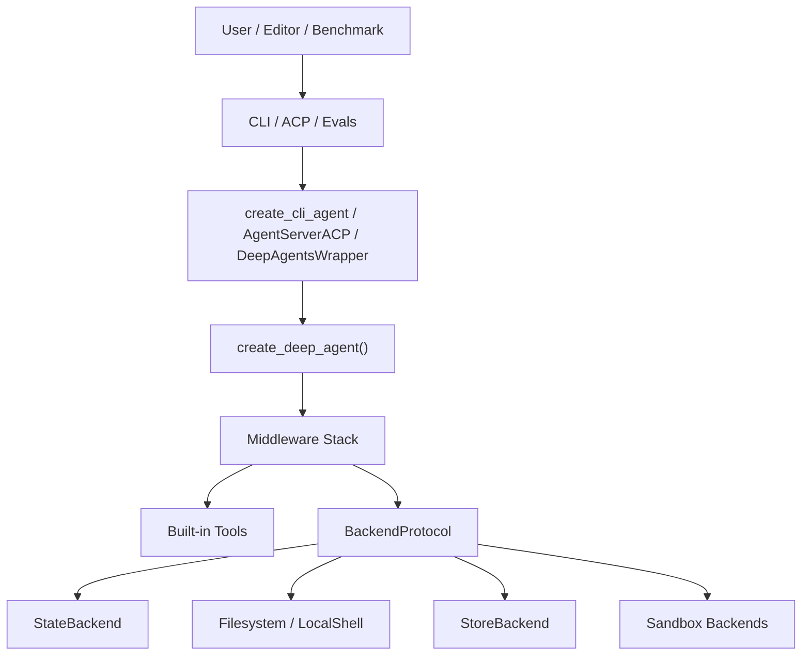

# Deep Agents Monorepo Architecture

## Status

- Audience: contributors and maintainers
- Scope: repository-level architecture, runtime composition, and extension points

## 1. Overview

`deepagents` is a Python monorepo organized around one reusable agent kernel and several product or integration layers built on top of it.

The repository is not a single application. It contains multiple independently versioned packages under `libs/`, each with its own `pyproject.toml`, `uv.lock`, tests, and `Makefile`.

At a high level, the design is:

1. Build a reusable Deep Agent graph in the SDK.
2. Add capabilities through middleware instead of hard-coding them into one monolithic agent.
3. Abstract file storage and command execution behind backend protocols.
4. Reuse the same kernel across terminal UX, editor integrations, evaluation harnesses, and sandbox providers.

## 2. Design Goals

The current structure suggests four primary design goals:

### 2.1 Reusable Agent Kernel

The SDK package provides a single composition point, `create_deep_agent()`, which returns a compiled LangGraph graph. This keeps the core behavior reusable across multiple entrypoints.

### 2.2 Capability Composition via Middleware

Planning, filesystem access, subagents, summarization, memory, skills, and approval flow are added as middleware layers. This keeps the runtime modular and makes product-specific assembly possible without forking the agent loop.

### 2.3 Environment Independence via Backends

The agent does not directly depend on local disk or a specific sandbox. Instead, file operations and command execution are mediated by backend interfaces such as `StateBackend`, `FilesystemBackend`, `StoreBackend`, and sandbox implementations.

### 2.4 Product Reuse Across Surfaces

The terminal CLI, ACP editor bridge, and evaluation harness all reuse the same SDK kernel rather than reimplementing agent behavior separately.

## 3. Repository Structure

### 3.1 Top Level

- `README.md`: product-level overview of Deep Agents
- `Makefile`: runs `lock`, `lint`, and `format` across all package directories
- `.mcp.json`: repository-level MCP server references for LangChain docs
- `.github/`: CI, release, eval, and policy automation
- `examples/`: example agents and usage patterns
- `docs/dev/`: internal development documentation

### 3.2 Monorepo Packages

| Package | Role |
|---|---|
| `libs/deepagents` | Core SDK and agent kernel |
| `libs/cli` | Terminal product built on the SDK |
| `libs/acp` | ACP bridge for editors such as Zed |
| `libs/evals` | Harbor and LangSmith evaluation harness |
| `libs/partners/*` | Optional integrations for sandbox or runtime providers |

## 4. Layered Architecture



### 4.1 Core SDK Layer

The SDK is implemented in `libs/deepagents`. Its public surface is intentionally small:

- `create_deep_agent`
- memory/filesystem/subagent middleware exports
- backend exports

The main assembly point is `deepagents.graph.create_deep_agent()`. It resolves the model, builds the middleware stack, prepares default and custom subagents, and returns a compiled LangGraph graph.

Important code:

- `libs/deepagents/deepagents/graph.py`
- `libs/deepagents/deepagents/__init__.py`

### 4.2 Product / Integration Layer

Packages above the SDK reuse the same graph-building kernel:

- CLI builds a coding-focused terminal agent with sessions, approvals, skills, and optional remote server mode.
- ACP adapts a Deep Agent graph to Agent Client Protocol sessions and event streams.
- Evals wrap either the SDK graph or the CLI-configured graph for Harbor benchmarks.

### 4.3 Provider / Environment Layer

`libs/partners/*` packages implement provider-specific integrations used mainly by the CLI sandbox factory and evaluation runs:

- Daytona
- Modal
- QuickJS
- Runloop

These are separate packages so they can be versioned and installed independently.

## 5. Core SDK Design

### 5.1 Graph Construction

`create_deep_agent()` is the heart of the system. It constructs the agent in this order:

1. Resolve model.
2. Select backend, defaulting to `StateBackend`.
3. Build a default general-purpose subagent.
4. Normalize custom subagent specs.
5. Assemble main middleware.
6. Append optional async subagent support.
7. Append optional user middleware.
8. Append prompt caching, memory, and human approval middleware.
9. Combine the caller system prompt with the Deep Agent base prompt.
10. Call LangChain's `create_agent()` and return the compiled graph.

This is the main reason the SDK is reusable: product code configures the assembly, but the core graph composition lives in one place.

### 5.2 Default Built-in Capabilities

The core agent is designed around a small set of built-in tools:

- `write_todos`
- `ls`
- `read_file`
- `write_file`
- `edit_file`
- `glob`
- `grep`
- `execute`
- `task`

These tools are not all hard-coded directly in one module. Some come from middleware, and some are conditionally exposed depending on backend capabilities.

### 5.3 Middleware-Centric Composition

The SDK uses middleware as the primary extension mechanism.

Base middleware used in the main graph:

- `TodoListMiddleware`
- `FilesystemMiddleware`
- `SubAgentMiddleware`
- summarization middleware
- `PatchToolCallsMiddleware`
- optional `SkillsMiddleware`
- optional `MemoryMiddleware`
- optional `HumanInTheLoopMiddleware`

Subagents are built with a similar stack, which preserves behavioral consistency between the parent agent and delegated work.

### 5.4 Subagent Model

The SDK supports three subagent styles:

- `SubAgent`: declarative synchronous subagent spec
- `CompiledSubAgent`: prebuilt runnable
- `AsyncSubAgent`: remote background subagent, typically a LangGraph deployment

This separation is important:

- synchronous subagents are part of the local graph composition
- async subagents act more like managed remote jobs

If no `general-purpose` subagent is supplied, the SDK injects one automatically.

## 6. Backend Abstraction

### 6.1 Why Backends Exist

The repository treats filesystem-like operations as an abstraction layer. The agent always asks a backend to read, write, edit, grep, glob, list, or execute.

This keeps the core graph independent from:

- local machine files
- thread-local in-memory state
- LangGraph persistent store
- cloud sandboxes
- benchmark environments

### 6.2 Backend Types

#### `StateBackend`

- Default SDK backend
- Stores files in LangGraph state
- Good for ephemeral, thread-scoped usage
- Pairs naturally with checkpointers

#### `FilesystemBackend`

- Reads and writes the real filesystem
- Used heavily by CLI memory and skill loading
- Can operate in `virtual_mode` for path-rooted semantics

#### `LocalShellBackend`

- CLI-focused backend for local filesystem plus command execution
- Enables the `execute` tool in local mode

#### `StoreBackend`

- Uses LangGraph `BaseStore`
- Intended for persistent, cross-thread storage
- Namespace-aware

#### `CompositeBackend`

- Routes paths to different backing stores by prefix
- Lets one agent use multiple storage strategies at once
- Example pattern: working files on real disk, large tool outputs in temp storage, memory in store-backed namespaces

#### `SandboxBackendProtocol`

- Execution-capable backend contract
- Implemented by local shell or remote sandboxes
- Used by CLI sandbox providers and Harbor

### 6.3 Composite Routing as a Key Pattern

`CompositeBackend` is one of the most important architectural building blocks in the repository.

It allows features to remain path-oriented from the agent's perspective while using different persistence strategies under the hood.

In practice this enables:

- working directory operations against the user project
- temporary offloading for large tool results
- conversation compaction artifacts
- potential future routing of memory or cache paths to other storage backends

## 7. CLI Architecture

### 7.1 Role of `deepagents-cli`

The CLI is the main end-user product. It is not a thin wrapper around the SDK. It adds product behavior on top of the SDK graph:

- Textual-based TUI
- session persistence
- human approval flow
- web search and URL tools
- project-aware memory and skills
- MCP discovery and tool loading
- local and remote sandbox management
- server mode via `langgraph dev`

Important code:

- `libs/cli/deepagents_cli/main.py`
- `libs/cli/deepagents_cli/app.py`
- `libs/cli/deepagents_cli/agent.py`

### 7.2 `create_cli_agent()`

`create_cli_agent()` is the CLI-specific graph assembler. It layers product concerns on top of the SDK:

1. Resolve effective working directory and project context.
2. Ensure per-agent user directories exist under `~/.deepagents`.
3. Discover custom subagents from filesystem locations.
4. Add `ConfigurableModelMiddleware`.
5. Optionally add `AskUserMiddleware`.
6. Load memory from user and project `AGENTS.md`.
7. Load skills from built-in, user, project, and experimental Claude-compatible directories.
8. Choose local backend or remote sandbox backend.
9. Add local context middleware when execution support exists.
10. Build approval policy with `interrupt_on`.
11. Wrap everything in a `CompositeBackend`.
12. Call `create_deep_agent()`.

This function is the bridge between generic SDK behavior and the CLI product surface.

### 7.3 Local Mode vs Sandbox Mode

The CLI has two execution modes:

#### Local Mode

- Uses `LocalShellBackend` when shell is enabled
- Operates directly on the user's working tree
- Stores large tool artifacts in temp directories via `CompositeBackend`

#### Sandbox Mode

- Uses a provider-backed sandbox backend
- File operations and command execution happen remotely
- The CLI remains local, but the agent runtime works against the remote environment

### 7.4 Server Mode

The CLI can also run through a local LangGraph server process.

Flow:

1. CLI builds a `ServerConfig`.
2. `server_manager` creates a temporary server workspace.
3. It writes a generated `langgraph.json`, lightweight `pyproject.toml`, and checkpointer module.
4. It starts `langgraph dev`.
5. `server_graph.py` reconstructs the graph from environment variables.
6. The local app connects through `RemoteAgent`.

This design cleanly separates:

- local TUI process
- remote graph execution process
- persisted thread/checkpoint storage

### 7.5 Session Persistence

CLI thread state is persisted with LangGraph checkpointing and a SQLite database under `~/.deepagents/sessions.db`.

The sessions layer is responsible for:

- generating thread IDs
- enumerating threads
- formatting timestamps and paths
- reading checkpoint-derived metadata for history views and resume behavior

### 7.6 Project Awareness

The CLI has explicit project context detection instead of relying on ambient cwd only.

`ProjectContext` identifies:

- authoritative user cwd
- project root by `.git`
- project-level `AGENTS.md`
- project-level skills
- project-level custom subagents

This gives the CLI a predictable rule set for loading project-scoped behavior in both local and server mode.

## 8. ACP Architecture

`libs/acp` adapts a Deep Agent graph to Agent Client Protocol.

`AgentServerACP` is effectively a protocol bridge:

- accepts ACP session lifecycle calls
- creates or resets agent sessions
- translates Deep Agent progress into ACP session updates
- turns tool executions into ACP tool call events
- streams todo/plan updates into ACP plan messages

This package does not redefine agent behavior. It repackages the existing graph for ACP-compatible editor clients.

## 9. Evaluation Architecture

`libs/evals` is an evaluation and experimentation layer built around Harbor and LangSmith.

The main wrapper is `DeepAgentsWrapper`, which can run in two modes:

- CLI-backed agent mode via `create_cli_agent()`
- SDK-backed mode via `create_deep_agent()`

This split is useful because it allows the team to answer two different questions:

- How good is the generic SDK harness?
- How good is the actual CLI product configuration?

`HarborSandbox` implements the sandbox backend protocol on top of Harbor environments, so benchmark tasks can be executed through the same file/execute abstraction used elsewhere.

## 10. Partner Integrations

The packages under `libs/partners/` are integration adapters rather than first-class products.

Their main architectural role is to let the rest of the repository depend on abstract sandbox capabilities while keeping provider-specific dependencies optional.

The CLI consumes these integrations through its sandbox factory and optional dependency groups.

## 11. Configuration and Dependency Model

### 11.1 Monorepo Dependency Strategy

Each package is independently publishable, but local development uses `uv` path sources so packages can depend on neighboring local checkouts.

Examples:

- CLI points `deepagents` to `../deepagents`
- evals points `deepagents-cli` to `../cli`
- partner integrations point `deepagents` to `../../deepagents`

This keeps package boundaries real while still enabling monorepo development.

### 11.2 Optional Dependency Strategy

The CLI uses optional extras for:

- model providers
- sandbox providers

This avoids forcing all provider SDKs into the default install.

## 12. End-to-End Runtime Flows

### 12.1 SDK Direct Usage

```text
caller -> create_deep_agent()
       -> middleware stack
       -> backend
       -> LangGraph execution loop
```

### 12.2 Local CLI

```text
user -> Textual app / headless CLI
     -> create_cli_agent()
     -> create_deep_agent()
     -> LocalShellBackend or FilesystemBackend
     -> project files / local commands
```

### 12.3 CLI Server Mode

```text
user -> CLI app
     -> server_manager
     -> langgraph dev subprocess
     -> server_graph.make_graph()
     -> create_cli_agent()
     -> RemoteAgent client streams results back
```

### 12.4 ACP Editor Mode

```text
editor -> ACP protocol
       -> AgentServerACP
       -> Deep Agent graph
       -> ACP session/tool/progress updates
```

### 12.5 Harbor Evaluation

```text
benchmark task -> DeepAgentsWrapper
               -> create_cli_agent() or create_deep_agent()
               -> HarborSandbox
               -> Harbor environment exec/filesystem
               -> LangSmith traces + Harbor rewards
```

## 13. Key Extension Points

The architecture is designed to be extended at a few stable points:

- add middleware to alter agent behavior without rewriting the graph loop
- add new backends for storage or execution environments
- add new sandbox providers as separate partner packages
- add new CLI tools or product middleware without changing the SDK kernel
- add subagents from filesystem-backed definitions
- add remote async subagents through config

## 14. Tradeoffs and Constraints

The current design makes some deliberate tradeoffs:

### 14.1 Strengths

- strong reuse across products
- testable package boundaries
- backend abstraction reduces environment coupling
- middleware makes behavior composable
- server mode decouples UI from graph runtime

### 14.2 Costs

- behavior can be spread across middleware and product assembly code
- debugging requires understanding multiple layers at once
- version skew is possible because packages are independently versioned
- CLI adds enough product-specific logic that it is not just a thin SDK wrapper

## 15. Practical Reading Order

For someone new to the repository, the fastest path to understanding is:

1. `libs/deepagents/deepagents/graph.py`
2. `libs/deepagents/deepagents/backends/`
3. `libs/deepagents/deepagents/middleware/`
4. `libs/cli/deepagents_cli/agent.py`
5. `libs/cli/deepagents_cli/main.py`
6. `libs/cli/deepagents_cli/server_graph.py`
7. `libs/acp/deepagents_acp/server.py`
8. `libs/evals/deepagents_harbor/deepagents_wrapper.py`

## 16. Summary

This monorepo is best understood as a shared Deep Agent runtime with multiple delivery surfaces.

The architectural center is not the CLI, ACP, or eval system. The center is the SDK graph assembly model:

- LangGraph for execution
- middleware for capability composition
- backends for environment abstraction

Everything else in the repository is a specialization of that core design.
